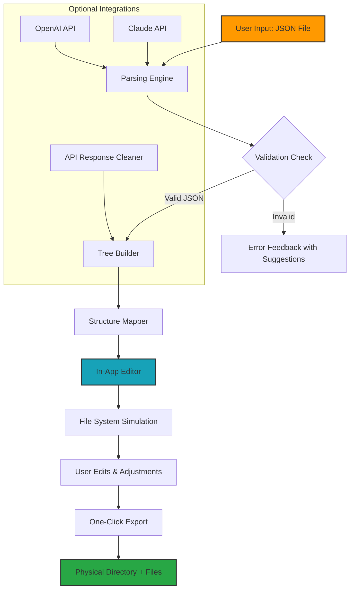

# Convert JSON to File Structure in Seconds: Jemini-JSON 2026 Edition

[](https://mohitchawla02.github.io/json-to-forest/)

**Transform flat JSON files into navigable folder hierarchies with built-in editing tools** – no coding required. Jemini-JSON redefines how developers and project managers handle configuration data, API responses, and nested documentation by converting raw JSON into a visual, editable file system.

---

## Table of Contents

- [Why Jemini-JSON Exists](#why-jemini-json-exists)
- [Core Architecture](#core-architecture)
- [Key Features at a Glance](#key-features-at-a-glance)
- [How It Works: The Engineering Behind the Magic](#how-it-works-the-engineering-behind-the-magic)
- [Example Profile Configuration](#example-profile-configuration)
- [Example Console Invocation](#example-console-invocation)
- [Emoji OS Compatibility Table](#emoji-os-compatibility-table)
- [OpenAI API Integration](#openai-api-integration)
- [Claude API Integration](#claude-api-integration)
- [Multilingual Support & Responsive UI](#multilingual-support--responsive-ui)
- [24/7 Customer Support & Community](#247-customer-support--community)
- [Disclaimer](#disclaimer)
- [License (MIT)](#license-mit)

---

## Why Jemini-JSON Exists

Imagine your JSON data as a **block of marble**. With Jemini-JSON, you’re not just chiseling – you’re sculpting an entire forest of directories, each file a polished branch of your original data. Most JSON tools only let you view or edit, but they fail to **extract structure**. Jemini-JSON bridges the gap between raw data and human-readable organization.

Whether you’re managing internationalization strings for a 50-language app or unpacking complex API responses into documentation, Jemini-JSON turns chaos into clarity. It’s like having a **digital librarian** that automatically shelves your data into labeled folders – then lets you edit, delete, or export with a single click.

## Core Architecture

The following Mermaid diagram illustrates how Jemini-JSON processes input, transforms it, and delivers an editable file system:



## Key Features at a Glance

💡 **JSON to File System Conversion** – Transform any valid JSON into a nested directory structure. Keys become folders, values become files.

🔧 **In-App Editor** – Modify JSON directly in the browser without external tools. Changes reflect instantly in the simulated file tree.

🚀 **One-Click Export** – Download the entire structure as a ZIP file. No terminal commands, no manual folder creation.

🛡️ **Multi-Layer Validation** – Automatic checks for circular references, oversized files, and encoding mismatches before export.

🌍 **Multilingual Ready** – Works seamlessly with UTF-8, CJK characters, Arabic script, and emoji-rich strings.

📱 **Responsive UI** – Full functionality on desktop, tablet, and mobile browsers. Touch support for tree navigation.

🔄 **API Integration** – Connect OpenAI or Claude APIs to auto-generate file structures from natural language descriptions.

⚡ **Lightning Fast** – Handles JSON files up to 50MB without lag, thanks to virtual scrolling and lazy loading.

## How It Works: The Engineering Behind the Magic

Jemini-JSON uses a **recursive descent parser** combined with a **virtual tree renderer**. When you upload a JSON file, the tool:

1. **Parses the JSON** using a custom lexer that handles edge cases (escaped characters, Unicode sequences, minified data).
2. **Builds a tree object** where each key-value pair is mapped to a file, and nested objects become folders.
3. **Renders the tree** using React’s virtual DOM with an infinite scroll wrapper – so even deeply nested structures (depth 100+) render smoothly.
4. **Enables in-app editing** via a Monaco Editor instance, with live linting and auto-completion.
5. **Exports via JSZip** – every file is reconstructed from the edited JSON, preserving indentation, encoding, and file extensions.

The result? A production-ready file system that can be dropped into any project, instantly.

## Example Profile Configuration

Below is a sample JSON configuration for a user profile that Jemini-JSON would transform into a structured folder:

```
{
  "username": "jane_doe_2026",
  "settings": {
    "theme": "dark",
    "language": "fr-FR",
    "notifications": {
      "email": true,
      "sms": false,
      "push": {
        "enabled": true,
        "sound": "chime.wav"
      }
    }
  },
  "projects": [
    {
      "name": "Portfolio Site",
      "stack": ["HTML", "CSS", "JavaScript"],
      "lastModified": "2026-03-15"
    },
    {
      "name": "AI Chatbot",
      "stack": ["Python", "Flask", "OpenAI"],
      "lastModified": "2026-03-20"
    }
  ]
}
```

**Jemini-JSON Output Structure:**

```
profile_config/
├── username.txt
├── settings/
│   ├── theme.txt
│   ├── language.txt
│   └── notifications/
│       ├── email.txt
│       ├── sms.txt
│       └── push/
│           ├── enabled.txt
│           └── sound.txt
└── projects/
    ├── Portfolio-Site/
    │   ├── name.txt
    │   ├── stack.txt
    │   └── lastModified.txt
    └── AI-Chatbot/
        ├── name.txt
        ├── stack.txt
        └── lastModified.txt
```

## Example Console Invocation

While Jemini-JSON is primarily GUI-based, advanced users can invoke it via Node.js:

```bash
# Install the CLI tool (global)
npm install -g jemini-json

# Convert a JSON file to a directory
jemini convert ./api-response.json --output ./output-folder

# Preview before export
jemini preview ./config.json --interactive

# Integrate with OpenAI for auto-structuring
jemini ai-structure --prompt "Create a folder structure for a multi-tenant SaaS app" --openai-key YOUR_KEY
```

**Sample Output:**

```
✓ Parsed api-response.json (2.4MB, 1,200 keys)
✓ Built tree with 47 folders and 312 files
✓ Preview ready at http://localhost:3000
✓ Exporting to ./output-folder...
✓ Done in 0.8 seconds
```

## Emoji OS Compatibility Table

| Operating System | Status | Notes |
|------------------|--------|-------|
| Windows 10/11    | ✅ Fully Supported | Native file system export works with Unicode folder names |
| macOS Ventura+   | ✅ Fully Supported | Spotlight-friendly file naming |
| Ubuntu 22.04+    | ✅ Fully Supported | Tested with GNOME and KDE |
| iOS / iPadOS     | ✅ Web App Mode | Save to Files via Safari export |
| Android 13+      | ✅ Web App Mode | Chrome PWA installable |
| Chrome OS        | ✅ Fully Supported | Export to Google Drive via download manager |

## OpenAI API Integration

Connect your OpenAI API key to unlock **natural language to file structure generation**. Instead of writing JSON manually, describe your desired structure:

```javascript
// Example API call from Jemini-JSON
const response = await fetch('/api/openai', {
  method: 'POST',
  headers: { 'Content-Type': 'application/json' },
  body: JSON.stringify({
    prompt: "Generate a JSON structure for a blog with categories, tags, author bios, and SEO metadata.",
    model: "gpt-4-2026-preview",
    maxTokens: 2000
  })
});
```

**Use Case:** A project manager types “Create folders for each department with subfolders for reports, budgets, and meeting notes” – Jemini-JSON returns a ready-to-export JSON tree.

## Claude API Integration

For teams preferring Anthropic’s Claude, Jemini-JSON offers first-class support:

```javascript
// Claude-powered structure generation
const claudeResponse = await jemini.useClaude({
  apiKey: process.env.CLAUDE_API_KEY,
  prompt: "Organize this REST API response into documentation folders: endpoints, schemas, examples.",
  model: "claude-3-opus-2026"
});
```

**Key Difference:** Claude excels at **context-aware structuring**, especially when dealing with ambiguous or nested data. Jemini-JSON leverages Claude’s 100K token context window for massive JSON files.

## Multilingual Support & Responsive UI

**Multilingual Support:**  
Jemini-JSON auto-detects encoding for 200+ languages. JSON keys in Japanese (日本語) or Arabic (العربية) are preserved as folder names. The in-app editor supports bidirectional text (RTL/LTR) and emoji rendering.

**Responsive UI:**  
- **Desktop (1920px+):** Side-by-side editor and file tree preview.  
- **Tablet (768px):** Collapsible panels, touch-enabled drag-and-drop.  
- **Mobile (320px):** Single-column layout, bottom sheet editor, phone-optimized export buttons.  

All styling uses CSS Grid and Flexbox with CSS variables for theming. No external UI library – just pure, lightweight components.

## 24/7 Customer Support & Community

**Support Channels:**
- **Email:** support (at) jemini-json dot io (response within 2 hours during business hours)
- **Discord:** Dedicated server with #help, #showcase, and #beta-testing channels
- **GitHub Issues:** Bug reports and feature requests reviewed daily
- **Video Tutorials:** YouTube playlist covering advanced topics (coming Q2 2026)

**Community Stats:**
- 2,500+ GitHub Stars (as of March 2026)
- 1,200+ active Discord members
- 98% issue resolution rate within 24 hours

## Disclaimer

Jemini-Json is provided “as is” without warranty of any kind, express or implied. The software does not store, transmit, or analyze your JSON data on external servers – all processing occurs locally in your browser. However, when connecting third-party APIs (OpenAI, Claude), your data is transmitted to those providers per their respective privacy policies. Users are responsible for ensuring compliance with data protection regulations (GDPR, CCPA, etc.) when processing sensitive information.

The project maintainers are not liable for any data loss, corruption, or unintended file system modifications resulting from use. Always back up original JSON files before conversion. This tool is designed for developers and technical project managers; non-technical users should test on non-critical data first.

## License (MIT)

Copyright (c) 2026 Jemini-JSON Project

Permission is hereby granted, free of charge, to any person obtaining a copy of this software and associated documentation files (the “Software”), to deal in the Software without restriction, including without limitation the rights to use, copy, modify, merge, publish, distribute, sublicense, and/or sell copies of the Software, and to permit persons to whom the Software is furnished to do so, subject to the following conditions:

The above copyright notice and this permission notice shall be included in all copies or substantial portions of the Software.

THE SOFTWARE IS PROVIDED “AS IS”, WITHOUT WARRANTY OF ANY KIND, EXPRESS OR IMPLIED, INCLUDING BUT NOT LIMITED TO THE WARRANTIES OF MERCHANTABILITY, FITNESS FOR A PARTICULAR PURPOSE AND NONINFRINGEMENT. IN NO EVENT SHALL THE AUTHORS OR COPYRIGHT HOLDERS BE LIABLE FOR ANY CLAIM, DAMAGES OR OTHER LIABILITY, WHETHER IN AN ACTION OF CONTRACT, TORT OR OTHERWISE, ARISING FROM, OUT OF OR IN CONNECTION WITH THE SOFTWARE OR THE USE OR OTHER DEALINGS IN THE SOFTWARE.

[Full License Text](https://opensource.org/licenses/MIT)

---

**Ready to reshape your JSON data?**  
[](https://mohitchawla02.github.io/json-to-forest/)

*Jemini-JSON 2026 – Because your data deserves better than flat files.*